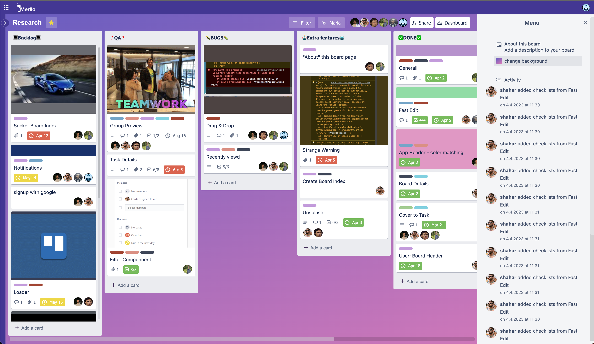

# Merllo

Merllo is a Trello clone web-based Kanban board application that helps users to manage their tasks and projects easily and efficiently. This repository contains the source code for the Merllo application, including both the backend and frontend components.

You can access the deployed application at https://merllo-0m15.onrender.com/#/.

## Navigation

- [Features](#features)
- [Technology Stack](#technology-stack)
- [Screenshots](#screenshots)
- [Mobile](#mobile)
- [Getting Started](#getting-started)

## Features

- User registration and authentication
- Create and manage multiple boards and lists
- Add, edit, and delete tasks
- Drag and drop tasks between lists
- Assign tasks to users
- Set due dates and priority levels for tasks
- Filter tasks based on their status and priority
- Search for tasks by title or description
- Collaborate with other users on the same board

## Technology Stack

### Frontend
- Vue
- Vuex
- Vue Router
- Axios
- Scss

### Backend
- Node.js
- Express
- MongoDB
- bcrypt

## Screenshots

### Landing Page

The Merllo landing page features a login button for a guest account or a link to the login page.

### Projects View

The projects view displays all of the projects of the user. Users can create new project with title and background.

### Board View

The board view displays all of the tasks for a selected project. Users can create new tasks, move tasks between lists by dragging and dropping them, and view the details of each task by clicking on it.

### Task Details

The task details page displays all of the information for a selected task, including the title, description, due date, priority level, and assigned user. Users can edit any of the task details or delete the task entirely.

### Fast Edit

Allow sdut the task in a faster way.

### Sharing Page

Allows the user to connect new member to the project.

### Board Settings

The board settings page allows users to edit the background of the currently selected board. It shows the last member's activities of the board.

### Project Navigation

Allows the user to navigate between his projects.

### Dash Board

The Dash Board Page shows information about the current project.

### Login Page

The login page allows users to log in to their Merllo account or create a new account if they don't already have one.

## Mobile

## Getting Started

To run the Merllo application locally, follow these steps:

1. Clone this repository to your local machine.
2. Navigate to the `merllo-backend` directory and run `npm install` to install the backend dependencies.
3. Start the backend server by running `npm start`.
4. Navigate to the `merllo-frontend` directory and run `npm install` to install the frontend dependencies.
5. Start the frontend server by running `npm run serve`.
6. Open your web browser and navigate to `http://localhost:8080` to access the Merllo application.
